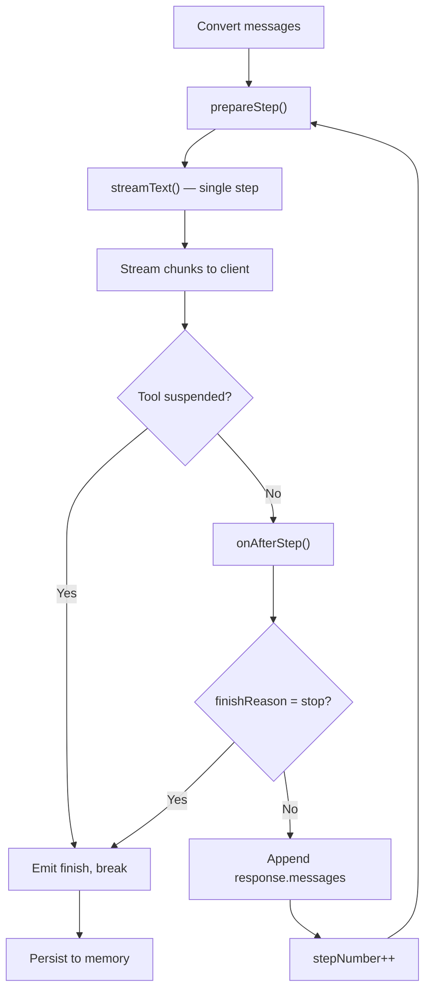

At the core of every agent is a loop: the model generates a response, optionally calls tools, the tool results are fed back, and the model generates again. This continues until the model stops or a tool suspends.

ZAIKit owns this loop directly rather than delegating it to the AI SDK. Each iteration makes a single-step `streamText()` call, giving the agent full control between steps for [middleware and hooks](/concepts/middleware-and-hooks).

## The Loop



In code, the core of the loop looks like this:

```ts
let currentModelMessages = await convertToModelMessages(ctx.messages);
let stepNumber = 0;
let allSteps: StepResult[] = [];

while (true) {
  const overrides = await prepareStep?.({ steps: allSteps, stepNumber, model, messages: currentModelMessages }) ?? {};

  const result = streamText({
    model: overrides.model ?? model,
    system: overrides.system ?? system,
    tools: overrides.activeTools ? filterTools(tools, overrides.activeTools) : tools,
    messages: overrides.messages ?? currentModelMessages,
    toolChoice: overrides.toolChoice,
  });

  // Stream chunks to client, detecting suspensions
  for await (const chunk of result.toUIMessageStream()) {
    // forward chunks, replace SuspendResult with data-tool-suspend
  }

  if (hasSuspension) break;

  allSteps.push(...(await result.steps));
  const finishReason = await result.finishReason;
  await onAfterStep?.({ step: allSteps.at(-1)!, steps: [...allSteps] });

  if (finishReason === "stop") break;

  // Chain: append response messages for the next step
  const response = await result.response;
  currentModelMessages = [...currentModelMessages, ...response.messages];
  stepNumber++;
}
```

The model decides whether to call tools based on the conversation context and tool descriptions. When tools are called, `streamText` executes them and the loop feeds the results back for the next model turn. This repeats until the model produces only text (`finishReason === "stop"`) or a tool suspends.

## Suspension Detection

Suspension is detected by inspecting stream chunks as they flow through the loop. When a `tool-output-available` chunk contains a `SuspendResult`, the loop:

1. Replaces it with a `data-tool-suspend` chunk (carrying the suspension payload)
2. Sets a `hasSuspension` flag
3. Breaks out of the loop after the step's stream is consumed

This means suspended tools appear as interactive UI components on the client rather than completed tool calls. The `data-tool-suspend` part carries arbitrary data chosen by the tool author so the client renderer knows what to display.

## Step Limits

### `maxSteps` option

Both `stream()` and `generate()` accept a `maxSteps` option that limits the number of loop iterations. `generate()` defaults to `maxSteps: 10` as a safety bound for sub-agent calls:

```ts
// Explicit limit on stream
const { stream, result } = await agent.stream({
  messages,
  maxSteps: 5,
});

// generate defaults to 10, can be overridden
const result = await agent.generate({
  prompt: "...",
  maxSteps: 3,
});
```

### `onAfterStep` hook

For more control, use `onAfterStep` to inspect step results and throw to abort:

```ts
const agent = createAgent({
  model,
  memory,
  onAfterStep: ({ steps }) => {
    if (steps.length >= 5) {
      throw new Error("Max steps (5) reached");
    }
  },
});
```

Throwing from a hook aborts the loop and closes the stream.

## Persistence

Persistence is a `chat()` concern -- `stream()` and `generate()` do not interact with memory. When `chat()` wraps the stream, it adds an `onFinish` callback that persists the assistant message:

- **New messages** are saved with `memory.addMessage()`.
- **Resumed messages** are updated in-place with `memory.updateMessage()`, preserving the original message ID.

The persisted message reflects the final state of the stream, including any `data-tool-suspend` parts. When a tool is later resumed, the agent finds the suspension by scanning the stored message parts.

## Interception Points

The manual loop exposes three levels of interception. See [Middleware & Hooks](/concepts/middleware-and-hooks) for full details:

- **Middleware** — wraps the entire response (mutate context, transform stream, short-circuit)
- **Step hooks** — fire between LLM calls (`prepareStep`, `onAfterStep`)
- **Tool hooks** — wrap individual tool executions (`onBeforeToolCall`, `onAfterToolCall`)
