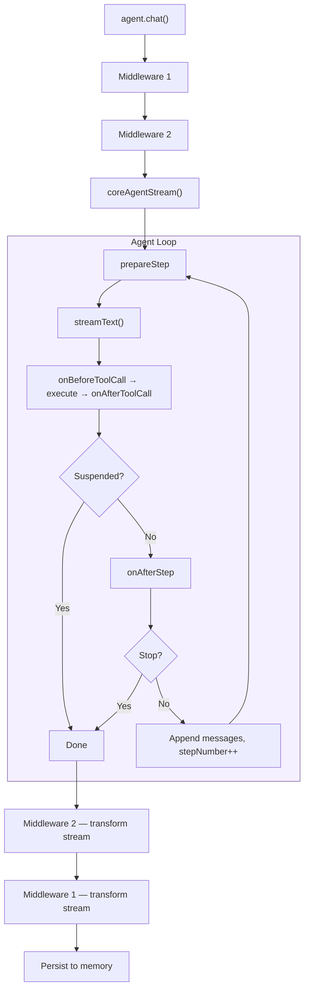
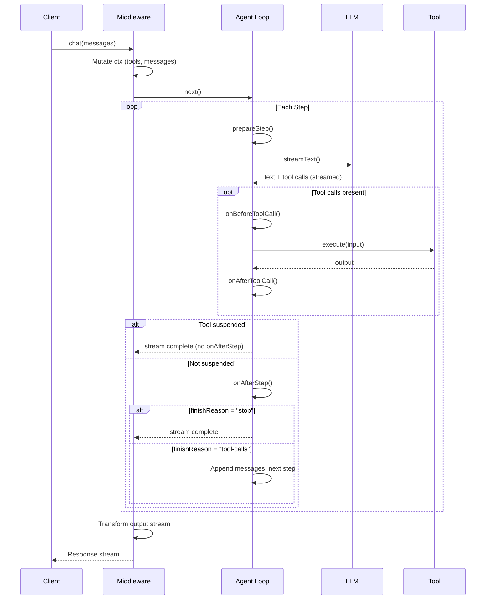

The agent provides three levels of interception, each targeting a different granularity of the request lifecycle:

| Level | Option | Scope |
| --- | --- | --- |
| **Message** | `middleware` | Wraps the entire response — mutate context, transform the output stream, or short-circuit entirely. |
| **Step** | `prepareStep` / `onAfterStep` | Fires between LLM calls in the multi-step loop — filter tools, swap models, enforce limits. |
| **Tool call** | `onBeforeToolCall` / `onAfterToolCall` | Wraps individual tool executions — modify inputs, transform outputs, block calls. |

## How it fits together

When `agent.chat()` is called, the request flows through middleware, then into the agent loop, where step and tool hooks fire on each iteration:



The full interaction as a sequence diagram:



---

## Middleware

Middleware uses an onion pattern — each middleware wraps the next one, with the core agent loop at the center. The first middleware in the array is the outermost layer.

```ts
type Middleware = (
  ctx: MiddlewareContext,
  next: () => ReadableStream<unknown>,
) => ReadableStream<unknown>;
```

### MiddlewareContext

The context object carries mutable fields that middleware can modify before calling `next()`:

| Field | Type | Mutable | Description |
| --- | --- | --- | --- |
| `messages` | `UIMessage[]` | Yes | Messages sent to the LLM. |
| `model` | `LanguageModel` | Yes | Language model to use. |
| `tools` | `ToolSet` | Yes | Tools available to the LLM. |
| `threadId` | `string` | No | Thread identifier. |
| `abort` | `(message: string) => never` | — | Abort the response with an error message. |

### Persistence model

Middleware changes to `ctx.messages` are **ephemeral** — they affect what the LLM sees but are never persisted. The persistence flow is:

1. `agent.chat()` saves the user's message to memory **before** middleware runs.
2. Messages are loaded from memory and passed to the middleware chain.
3. Middleware can mutate `ctx.messages` (inject context, rewrite prompts, etc.) — the LLM sees these changes.
4. After the stream completes, only the **assistant's response** is saved to memory.

This means the conversation history always reflects the user's actual input. Ephemeral context like RAG documents or system reminders is injected fresh on each request and never stored, keeping the thread clean and the retrieval up-to-date.

### Example: inject a system reminder

Append a system message to `ctx.messages`. This keeps the system prompt stable for [prompt caching](https://docs.anthropic.com/en/docs/build-with-claude/prompt-caching) and the reminder is ephemeral — it only exists for this LLM call.

```ts
const addReminder: Middleware = (ctx, next) => {
  ctx.messages = [
    ...ctx.messages,
    {
      id: "system-reminder",
      role: "system" as const,
      parts: [{ type: "text", text: "Reminder: always respond in JSON." }],
    },
  ];
  return next();
};
```

### Example: transform the output stream

Use `mapChunks` to transform stream chunks after the core loop produces them:

```ts
import { mapChunks } from "@zaikit/core";

const uppercase: Middleware = (ctx, next) => {
  const stream = next();
  return mapChunks(stream, (chunk: any) => {
    if (chunk.type === "text-delta") {
      return { ...chunk, delta: chunk.delta.toUpperCase() };
    }
    return chunk;
  });
};
```

### Example: cache / short-circuit

A middleware can skip `next()` entirely to return its own stream:

```ts
const cache: Middleware = (ctx, _next) => {
  const cached = lookupCache(ctx.messages);
  if (cached) return toStream(cached); // skip LLM entirely
  return _next();
};
```

### Example: abort

Call `ctx.abort()` to stop execution and return an error message as the response text:

```ts
const rateLimit: Middleware = (ctx, _next) => {
  if (isRateLimited(ctx.threadId)) {
    ctx.abort("Rate limit exceeded. Try again later.");
  }
  return _next();
};
```

### Composition order

Middleware executes outside-in before `next()` and inside-out after:

```ts
const agent = createAgent({
  middleware: [outer, inner],
  // ...
});

// Execution order:
// 1. outer — before next()
// 2. inner — before next()
// 3. coreAgentStream (the LLM loop)
// 4. inner — after next()
// 5. outer — after next()
```

---

## Step Hooks

Step hooks fire inside the agent loop, around each `streamText()` call.

| Hook | Can do | Cannot do |
| --- | --- | --- |
| `prepareStep` | Return per-step overrides: `activeTools`, `toolChoice`, `system`, `model`, `messages`. | Mutate context — return values only. Overrides are ephemeral (reset each step). |
| `onAfterStep` | Observe the full `StepResult` (usage, tool calls, text, finish reason, etc.). Throw to abort. | Mutate anything — context is read-only. The step's chunks are already streamed. |

### prepareStep (per-step overrides)

Fires before each LLM call. Returns an object of per-step overrides — they apply only to this step and reset on the next one. This follows the [AI SDK's `prepareStep` API](https://ai-sdk.dev/docs/reference/ai-sdk-core/stream-text#preparestep).

The function receives:

| Field | Type | Description |
| --- | --- | --- |
| `steps` | `StepResult[]` | All steps completed so far. |
| `stepNumber` | `number` | Current step (0-indexed). |
| `model` | `LanguageModel` | The model being used. |
| `messages` | `ModelMessage[]` | The messages about to be sent. |

It can return any of:

| Field | Type | Description |
| --- | --- | --- |
| `activeTools` | `string[]` | Only these tools are available for this step (filters from the base set). |
| `toolChoice` | `ToolChoice` | Force a specific tool or tool-calling mode. |
| `system` | `string` | Override the system prompt for this step. |
| `model` | `LanguageModel` | Override the model for this step. |
| `messages` | `ModelMessage[]` | Override the messages for this step. |
| `providerOptions` | `ProviderOptions` | Provider-specific options for this step. |

```ts
const agent = createAgent({
  model,
  tools: { search, summarize },
  memory,
  prepareStep: ({ stepNumber }) => {
    // Remove the search tool after step 2 to force the LLM to stop searching
    if (stepNumber > 2) {
      return { activeTools: ["summarize"] };
    }
    return {};
  },
});
```

### onAfterStep (observe / abort)

Fires after a step completes (stream consumed, results resolved). Receives the full `StepResult` from the AI SDK — use it for observability (logging, metrics, usage tracking) and enforcing limits by throwing.

Does **not** fire on suspension steps — when a tool suspends, the loop breaks before `onAfterStep` runs.

| Field | Type | Description |
| --- | --- | --- |
| `step` | `StepResult` | The step that just completed. Contains `finishReason`, `usage`, `toolCalls`, `toolResults`, `text`, `sources`, and more. |
| `steps` | `StepResult[]` | All steps completed so far, including this one. |

```ts
const agent = createAgent({
  model,
  memory,
  onAfterStep: ({ step, steps }) => {
    console.log(`Step ${steps.length - 1} finished: ${step.finishReason}`);
    console.log(`Token usage: ${step.usage.totalTokens}`);
    if (steps.length >= 5) {
      throw new Error("Max steps reached");
    }
  },
});
```

Throwing from a step hook aborts the loop — the error propagates and closes the stream.

---

## Tool Hooks

Tool hooks wrap individual tool `execute` functions. They run inside `streamText()` during tool execution — the modified input/output becomes part of the stream that middleware and the LLM see.

| Hook | Can do | Cannot do |
| --- | --- | --- |
| `onBeforeToolCall` | Modify the input the tool receives. Block execution by throwing (the SDK treats it as a tool error and the LLM adapts). Observe tool name and input. | Modify the output — the tool hasn't run yet. |
| `onAfterToolCall` | Modify the output the LLM sees. Observe the tool name, input, and output. | Modify the input — the tool already ran. Block execution — it already happened. |

### onBeforeToolCall (modify input / block)

Fires before a tool executes. Return `{ input }` to override the input, or throw to block execution entirely (the SDK treats the thrown error as a tool result, so the LLM sees the error message and can adapt).

| Field | Type | Description |
| --- | --- | --- |
| `toolName` | `string` | Name of the tool being called. |
| `toolCallId` | `string` | Unique ID for this tool call. |
| `input` | `unknown` | The input the LLM generated. Return `{ input }` to override. |

```ts
const agent = createAgent({
  model,
  tools: { delete_records, search },
  memory,
  onBeforeToolCall: (ctx) => {
    // Block dangerous tools
    if (ctx.toolName === "delete_records") {
      throw new Error("Deletion is disabled");
    }
    // Modify input for other tools
    if (ctx.toolName === "search") {
      return { input: { ...ctx.input, safeMode: true } };
    }
  },
});
```

### onAfterToolCall (modify output / observe)

Fires after a tool executes. Return `{ output }` to override the output the LLM sees. If you return nothing, the original output is used.

| Field | Type | Description |
| --- | --- | --- |
| `toolName` | `string` | Name of the tool that ran. |
| `toolCallId` | `string` | Unique ID for this tool call. |
| `input` | `unknown` | The final input (after `onBeforeToolCall` modifications, if any). |
| `output` | `unknown` | The tool's return value. Return `{ output }` to override what the LLM sees. |

```ts
const agent = createAgent({
  model,
  tools: { search },
  memory,
  onAfterToolCall: (ctx) => {
    // Redact sensitive data before the LLM sees it
    if (ctx.toolName === "search") {
      return { output: redactPII(ctx.output) };
    }
    // Log all tool results
    console.log(`${ctx.toolName} returned`, ctx.output);
  },
});
```

---

## Stream Utilities

`@zaikit/core` exports helpers for working with `ReadableStream` in middleware:

| Function | Description |
| --- | --- |
| `mapChunks(stream, fn)` | Transform or filter chunks. Return `null` to drop a chunk. |
| `collectStream(stream)` | Buffer an entire stream into `{ chunks: T[] }`. |
| `toStream(collected)` | Convert a collected result back to a `ReadableStream`. |

---

## Full example

Putting it all together:

```ts
import { createAgent, mapChunks, type Middleware } from "@zaikit/core";

const logging: Middleware = (ctx, next) => {
  console.log(`[${ctx.threadId}] ${ctx.messages.length} messages`);
  return next();
};

const agent = createAgent({
  model,
  system: "You are a helpful assistant.",
  tools: { search, calculator },
  memory,

  // Message-level: wraps the entire response
  middleware: [logging],

  // Step-level: fires between LLM calls
  prepareStep: ({ stepNumber }) => {
    if (stepNumber >= 5) {
      return { activeTools: [] }; // disable tools to force stop
    }
    return {};
  },
  onAfterStep: ({ step, steps }) => {
    console.log(`Step ${steps.length - 1}: ${step.finishReason}`);
  },

  // Tool-level: wraps individual tool executions
  onBeforeToolCall: (ctx) => {
    console.log(`Calling ${ctx.toolName}`, ctx.input);
  },
  onAfterToolCall: (ctx) => {
    console.log(`${ctx.toolName} returned`, ctx.output);
  },
});
```
