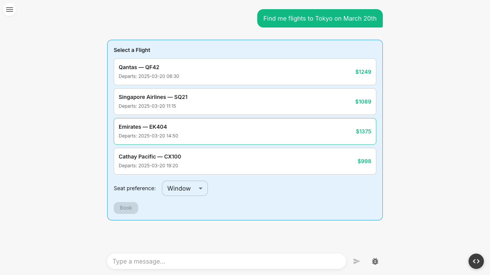

Some tool calls should not execute automatically. Deleting a database, sending an email, or placing an order are actions that benefit from human confirmation. ZAIKit's suspend/resume protocol lets a tool pause mid-execution, send data to the client for the user to act on, and then continue with the user's response.

## The Full Flow

Here is the complete lifecycle of a suspended tool call, from LLM invocation to resolution:

1. **LLM calls a tool** — The model decides to invoke a suspendable tool (e.g. `confirm_order`).

2. **Tool calls `suspend(payload)`** — Inside the tool's `execute` function, the code calls `suspend()` with a payload describing what the user needs to approve. This returns a `SuspendResult`.

3. **Stream transform intercepts** — The agent's `TransformStream` sees a `tool-output-available` chunk containing a `SuspendResult`. It replaces it with a `data-tool-suspend` chunk carrying the tool call ID, tool name, and payload.

4. **`hasSuspendedTool` stops the loop** — The built-in stop condition detects the `SuspendResult` and halts the `streamText` loop. The stream ends.

5. **Client receives suspension** — `useAgentChat` merges the `data-tool-suspend` part onto the corresponding tool part as a `suspend` field, and strips the raw `data-tool-suspend` from the parts array.

6. **Tool renderer shows UI** — `renderToolPart()` sees `state: "suspended"` and the `suspendPayload`, and renders the appropriate UI (a confirmation dialog, a form, etc.).

7. **User interacts** — The user clicks "Approve" (or fills out a form, etc.), which calls `resume(data)` from the render props.

8. **Client sends resume request** — `resume()` triggers a POST to the API with `{ threadId, resume: { toolCallId, data } }`.

9. **Agent finds the suspended message** — `handleResume` loads messages from memory and locates the one containing the matching `data-tool-suspend` part.

10. **Tool re-executes with `resumeData`** — The tool's `execute` function runs again. This time, `resumeData` is populated with the user's response. The tool checks `resumeData`, skips the `suspend()` call, and returns a normal result.

11. **Message updated in place** — The tool output replaces the suspension in the stored message. The `data-tool-suspend` part is marked as resolved.

12. **Remaining suspensions check** — If other tools in the same message are still suspended, the server ends the stream early without continuing the LLM. The client re-fetches messages and shows the remaining suspension UIs. Otherwise, the LLM continues with the updated conversation.



## Defining a Suspendable Tool

A suspendable tool declares `suspendSchema` and `resumeSchema` alongside the regular `inputSchema`. The `execute` function receives `{ input, suspend, resumeData, resumeHistory }`:

```ts
import { createTool } from "@zaikit/core";
import { z } from "zod";

const confirm_order = createTool({
  description: "Place an order after user confirmation",
  inputSchema: z.object({
    item: z.string(),
    quantity: z.number(),
    price: z.number(),
  }),
  suspendSchema: z.object({
    item: z.string(),
    quantity: z.number(),
    total: z.number(),
  }),
  resumeSchema: z.object({
    approved: z.boolean(),
  }),
  execute: async ({ input, suspend, resumeData }) => {
    // First invocation: no resumeData yet — suspend for approval
    if (!resumeData) {
      return suspend({
        item: input.item,
        quantity: input.quantity,
        total: input.quantity * input.price,
      });
    }

    // Second invocation: user has responded
    if (!resumeData.approved) {
      return { status: "cancelled" };
    }

    // Process the order...
    return { status: "confirmed", orderId: "ORD-123" };
  },
});
```

Key points:

- `suspend(payload)` returns a `SuspendResult`. You must return it from the execute function.
- `resumeData` is `undefined` on the first call and populated with the user's response on subsequent calls.
- `resumeHistory` is an array of all past resume responses (see [Multi-Suspend](#multi-suspend) below).
- Both `suspendSchema` and `resumeSchema` are validated with Zod at runtime.
- A regular (non-suspendable) tool receives `{ input, writeData }` in its execute function.

## The `SuspendResult` Type

Under the hood, `suspend()` produces a branded object:

```ts
type SuspendResult<T> = {
  readonly __suspended: true;
  readonly payload: T;
};
```

The `__suspended` marker lets the agent distinguish suspension from normal tool output. The `payload` is whatever data you passed to `suspend()` — it travels through the stream transform, into the SSE stream, and arrives on the client as `suspendPayload` in the tool render props.

## The AsyncLocalStorage Bridge

The AI SDK's `tool.execute` signature is `(input, { toolCallId, messages })` — there is no way to pass custom context. ZAIKit uses Node.js `AsyncLocalStorage` to thread resume data from the agent's `handleResume` into the tool's execute wrapper:

```ts
// agent.ts — when resuming
const output = await runWithToolInjection(
  { resumeData: resume.data, resumeHistory, context, writeData },
  () => toolDef.execute!(toolInput, { toolCallId, messages }),
);
```

```ts
// create-tool.ts — inside the execute wrapper
const { resumeData, resumeHistory } = getToolInjection();
result = await execute({ input, suspend, resumeData, resumeHistory });
```

This is an internal implementation detail. As a tool author, you simply use `resumeData` and `resumeHistory` from the execute arguments.

## Multiple Simultaneous Suspensions

The LLM can call multiple suspendable tools in a single step. Each one independently suspends, and all their `data-tool-suspend` parts are included in the streamed message.

When the user resolves one suspension:

1. The server marks that specific `data-tool-suspend` part as `resolved`.
2. It checks if any unresolved suspensions remain.
3. If yes, the stream ends early without continuing the LLM — the client re-fetches messages and shows the remaining UIs.
4. If all are resolved, the LLM continues with the full conversation.

This means suspensions are resolved one at a time. Each resolution updates the stored message in place until all tools have been addressed.

## Multi-Suspend

A tool can suspend more than once across its lifecycle. This is useful for multi-phase workflows — for example, a deploy tool that first asks "deploy?", then after deploying asks "activate traffic?".

### How It Works

Each time the user resumes a tool, the tool's `execute` function runs from scratch. The `resumeHistory` array accumulates all past resume responses:

| Invocation | `resumeHistory` | `resumeData` |
|---|---|---|
| 1st (initial) | `[]` | `undefined` |
| 2nd (first resume) | `[firstResponse]` | `firstResponse` |
| 3rd (second resume) | `[firstResponse, secondResponse]` | `secondResponse` |

Use `resumeHistory.length` to determine which phase the tool is in:

```ts
const deploy_service = createTool({
  description: "Deploy a service with confirmation gates",
  inputSchema: z.object({
    service: z.string(),
    environment: z.enum(["staging", "production"]),
  }),
  suspendSchema: z.object({
    phase: z.enum(["confirm-deploy", "activate-traffic"]),
    service: z.string(),
    version: z.string(),
  }),
  resumeSchema: z.object({ approved: z.boolean() }),
  execute: async ({ input, suspend, resumeHistory }) => {
    const version = "v2.1.0";

    // Phase 0: initial — run checks, ask to deploy
    if (resumeHistory.length === 0) {
      return suspend({ phase: "confirm-deploy", service: input.service, version });
    }

    // Phase 1: user responded to deploy confirmation
    if (resumeHistory.length === 1) {
      if (!resumeHistory[0].approved) {
        return { deployed: false, reason: "User cancelled" };
      }
      // Deploy succeeded — ask to activate traffic
      return suspend({ phase: "activate-traffic", service: input.service, version });
    }

    // Phase 2: user responded to traffic activation
    if (!resumeHistory[resumeHistory.length - 1].approved) {
      return { deployed: true, trafficActive: false };
    }
    return { deployed: true, trafficActive: true };
  },
});
```

### What Happens Under the Hood

1. When a tool re-suspends, the `data-tool-suspend` part in the stream is replaced (same `type` + `id` = update in place via the AI SDK's dedup behavior).
2. The `resumeHistory` is stored inside the suspend part's data in memory, so it persists across server restarts.
3. The client sees the same `state: "suspended"` with the new `suspendPayload` — no client-side changes are needed.
4. When all phases complete and the tool returns a result, the LLM continues as normal.

### `resumeData` vs `resumeHistory`

For single-suspend tools, use `resumeData` — it's simpler:

```ts
if (!resumeData) return suspend({ ... });
// resumeData is the user's response
```

For multi-suspend tools, use `resumeHistory` to track phases. `resumeData` always contains the most recent response (equivalent to `resumeHistory[resumeHistory.length - 1]`).

## What's Next

- **[Human-in-the-Loop Guide](/guides/human-in-the-loop)** — Step-by-step walkthrough of building interactive tool UIs
- **[`createTool` Reference](/reference/core/create-tool)** — Full API for suspendable tool options
