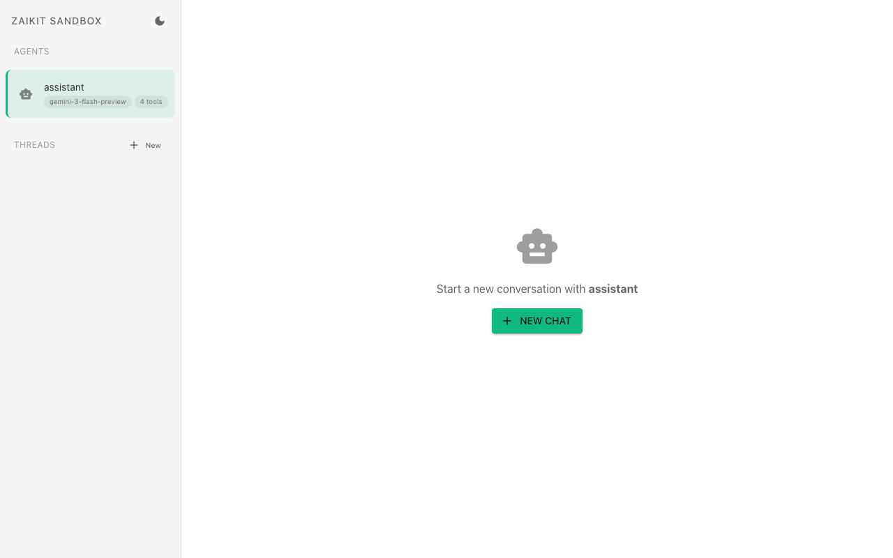
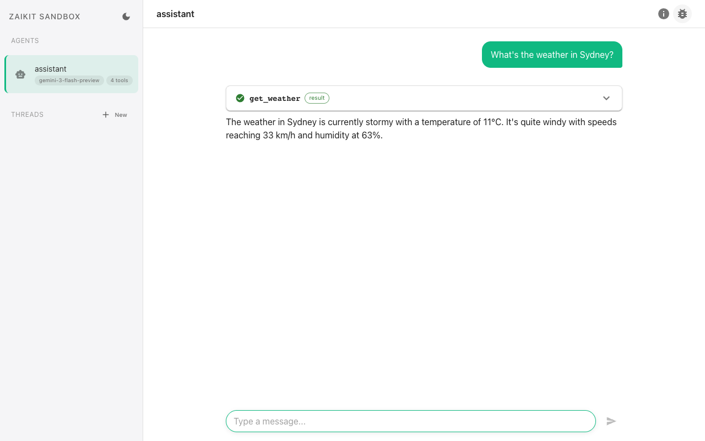
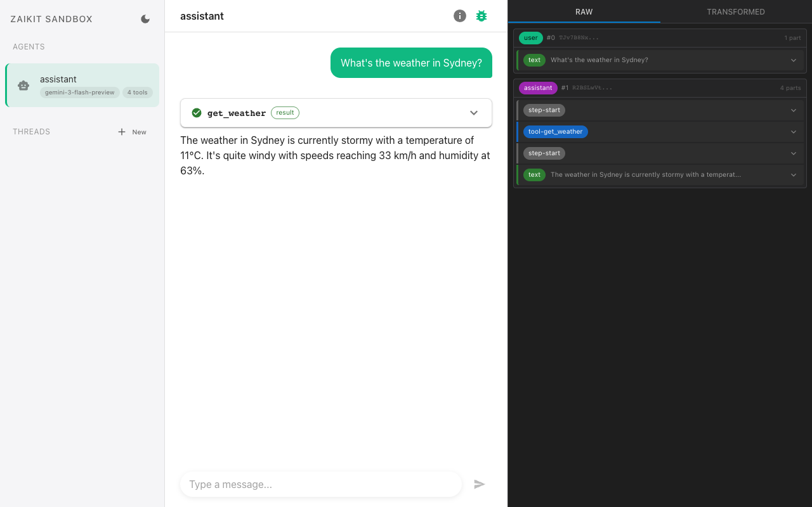
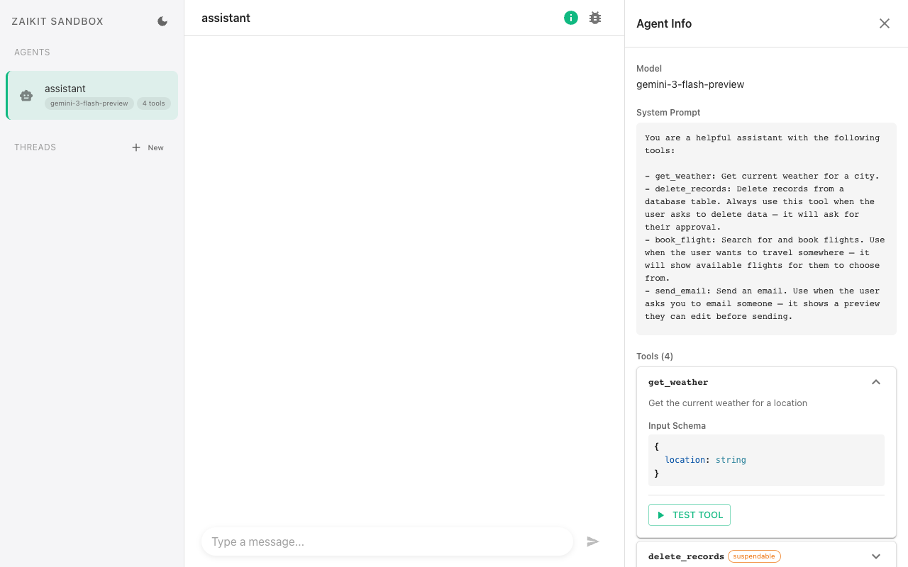
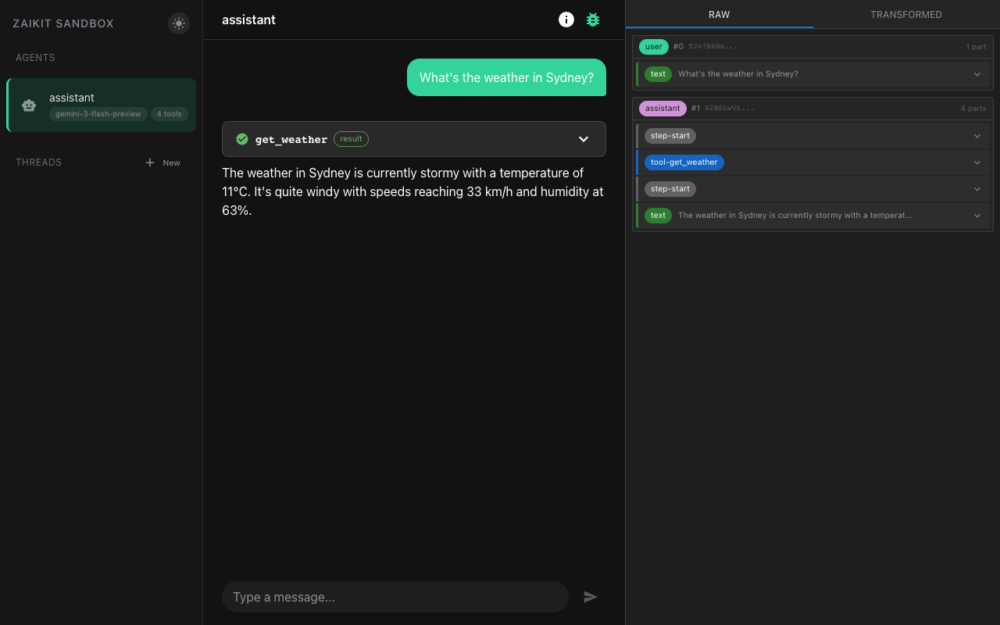

The sandbox is a built-in development UI that lets you interact with your agents, inspect tool calls, test tools in isolation, and debug suspend/resume flows — without building a frontend.

## Install

```bash
pnpm add @zaikit/sandbox
```

## Quick Start

Pass your agents to `createSandbox` and call `listen()`:

```ts title="sandbox.ts"
import { createAgent, createTool } from "@zaikit/core";
import { openai } from "@ai-sdk/openai";
import { z } from "zod";
import { createSandbox } from "@zaikit/sandbox";

const get_weather = createTool({
  description: "Get the current weather for a location",
  inputSchema: z.object({
    location: z.string().describe("City name, e.g. 'Sydney'"),
  }),
  execute: async ({ input }) => ({
    location: input.location,
    temperature: 22,
    condition: "Sunny",
  }),
});

const agent = createAgent({
  model: openai("gpt-4o"),
  system: "You are a helpful weather assistant.",
  tools: { get_weather },
});

const sandbox = createSandbox({
  agents: { weather: agent },
});

sandbox.listen(4000);
```

Then run:

```bash
npx tsx sandbox.ts
```

Open [http://localhost:4000](http://localhost:4000) in your browser.



## Features

### Multi-agent support

Register multiple agents and switch between them in the sidebar:

```ts
const sandbox = createSandbox({
  agents: {
    weather: weatherAgent,
    booking: bookingAgent,
    support: supportAgent,
  },
});
```

Each agent gets its own conversation threads and memory.

### Automatic in-memory persistence

If an agent doesn't have a memory adapter configured, the sandbox automatically attaches an in-memory store. You don't need to set up a database for development — threads and messages persist for the lifetime of the process.

If your agent already has a memory adapter (e.g. Postgres), the sandbox uses it as-is.

### Chat UI

The sandbox provides a full chat interface with:
- Markdown rendering (GitHub Flavored Markdown)
- Streaming responses
- Thread management (create, switch, delete)



### Tool call inspector

Toggle the debug sidebar to see the raw tool call data for every message — inputs, outputs, and metadata. This is useful for verifying that your tools receive the expected inputs and return the right shapes.



### Tool test panel

Each tool can be tested in isolation from the agent info panel. The sandbox reads your tool's Zod input schema and generates a form with appropriate field types. You can also switch to raw JSON input. This lets you test tool execution without waiting for the LLM to call it.



### Suspend/resume testing

Tools that use `suspend()` are fully supported. When a tool suspends, the sandbox renders the suspend payload and provides a form (generated from your `resumeSchema`) to submit resume data. This makes it easy to test human-in-the-loop flows.

## Configuration

### `createSandbox(config)`

| Option | Type | Description |
|---|---|---|
| `agents` | `Record<string, Agent>` | Map of agent name to agent instance. Names appear in the sidebar. |
| `basePath` | `string` | Optional mount prefix (e.g. `"/sandbox"`). Used when the sandbox is mounted under a subpath of a larger app. |

### `sandbox.listen(port?)`

Starts the sandbox HTTP server. Defaults to port `4000`.

### `sandbox.app`

The underlying Hono app instance. Use this if you want to mount the sandbox into an existing server instead of using `listen()`.

## Mounting into an existing app

If you already have a Hono server, mount the sandbox under a subpath:

```ts
import { Hono } from "hono";
import { createSandboxHono } from "@zaikit/sandbox/hono";

const app = new Hono();

// Your existing routes
app.get("/api/health", (c) => c.json({ status: "ok" }));

// Mount sandbox
const sandbox = createSandboxHono({
  agents: { weather: weatherAgent },
  basePath: "/sandbox",
});
app.route("/sandbox", sandbox);
```

The sandbox will be available at `http://localhost:3000/sandbox`.

### Express adapter

An Express adapter is also available:

```ts
import express from "express";
import { createSandboxExpress } from "@zaikit/sandbox/express";

const app = express();

const sandboxRouter = createSandboxExpress({
  agents: { weather: weatherAgent },
  basePath: "/sandbox",
});
app.use("/sandbox", sandboxRouter);

app.listen(3000);
```

## Dark mode

The sandbox supports light and dark modes. It follows your system preference by default, and you can toggle it from the theme button in the UI. The preference is persisted in `localStorage`.


