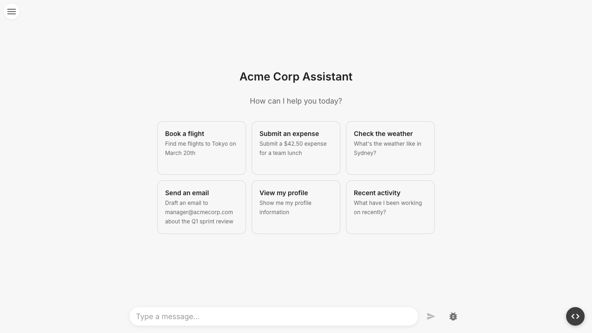

Build full-stack AI agents in TypeScript. Define tools on the server, stream responses to the browser, and render tool calls as React components — with persistence, human-in-the-loop, and type safety built in.



- **Full-stack agents** — Define your agent and tools on the server, connect from React with a single provider.
- **Streaming** — Responses stream from backend to browser over SSE with zero configuration.
- **Tool rendering** — Map tool calls to React components with full type inference via codegen.
- **Suspend and resume** — Tools can pause for human input and resume with the user's response.
- **Persistence** — Plug in a memory backend to save and restore conversations across sessions.

## Packages

| Package | Description |
|---|---|
| `@zaikit/core` | Agent and tool primitives — `createAgent`, `createTool` |
| `@zaikit/react` | React bindings — `AgentProvider`, `useAgent`, `useToolRenderer` |
| `@zaikit/memory` | Memory interface types — `Memory`, `Thread` |
| `@zaikit/memory-postgres` | PostgreSQL-backed conversation persistence |
| `@zaikit/memory-inmemory` | In-memory persistence for development and testing |
| `@zaikit/sandbox` | Development UI for testing agents, inspecting tools, and debugging |
| `@zaikit/codegen-react` | CLI to generate typed tool render props from your agent definition |

## Quick Example

**Backend** — define an agent with tools and expose it via an HTTP endpoint:

```ts title="server.ts"
import { createAgent, createTool } from "@zaikit/core";
import { createPostgresMemory } from "@zaikit/memory-postgres";
import { z } from "zod";

const memory = createPostgresMemory({
  connectionString: process.env.DATABASE_URL!,
});
await memory.initialize();

const agent = createAgent({
  model: yourModel, // any AI SDK LanguageModel
  tools: {
    get_weather: createTool({
      description: "Get weather for a city",
      inputSchema: z.object({ city: z.string() }),
      execute: async ({ input }) => ({
        city: input.city,
        temp: 22,
        condition: "Sunny",
      }),
    }),
  },
  memory,
});

// Hono / Express / any framework
app.post("/api/chat", async (c) => {
  const body = await c.req.json();
  return agent.chat(body);
});
```

**Frontend** — connect to the agent and render messages:

```tsx title="App.tsx"
import { AgentProvider, useAgent } from "@zaikit/react";

function Chat() {
  const { messages, sendMessage, renderToolPart } = useAgent();

  return (
    <div>
      {messages.map((m) => (
        <div key={m.id}>
          {m.parts.map((part, i) =>
            part.type === "text" ? (
              <p key={i}>{part.text}</p>
            ) : (
              renderToolPart(part)
            ),
          )}
        </div>
      ))}
      <button onClick={() => sendMessage?.({ text: "What's the weather?" })}>
        Send
      </button>
    </div>
  );
}

export default function App() {
  return (
    <AgentProvider
      api="/api/chat"
      threadId="thread-1"
      initialMessages={[]}
    >
      <Chat />
    </AgentProvider>
  );
}
```

## Next Steps

Head to the [Getting Started](/getting-started) guide to build your first agent.
